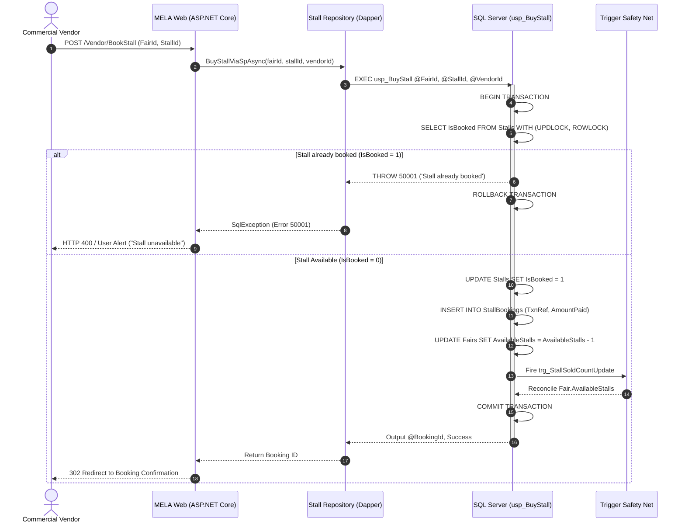
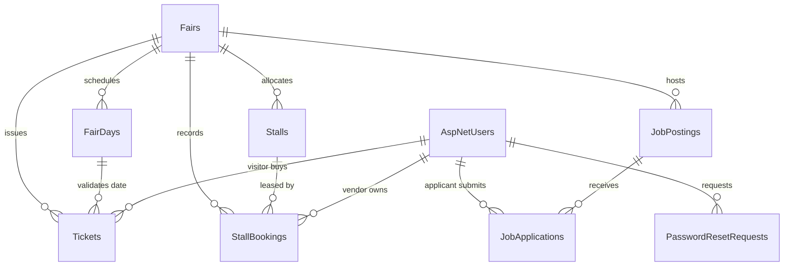

# MELA — Digital Fair & Event Management System

[](https://dotnet.microsoft.com/)
[](https://learn.microsoft.com/en-us/dotnet/csharp/)
[](https://dotnet.microsoft.com/apps/aspnet/mvc)
[](https://learn.microsoft.com/en-us/ef/core/)
[](https://github.com/DapperLib/Dapper)
[](https://www.microsoft.com/sql-server)
[](https://tailwindcss.com/)
[](https://www.docker.com/)
[](https://github.com/Turjo101365/MELA/actions/workflows/ci.yml)
[](https://opensource.org/licenses/MIT)

**MELA** is an enterprise-grade digital cultural fair, festival, and exhibition management platform engineered with **ASP.NET Core 8 MVC** and **Microsoft SQL Server 2022**. The platform bridges traditional cultural heritage and modern software engineering by coordinating complex multi-day events, orchestrating high-concurrency commercial stall leasing through explicit row-level update locks (`UPDLOCK, ROWLOCK`), enforcing admission safety quotas with defense-in-depth database triggers, and providing a unified recruitment board for seasonal event workforce.

- **Repository**: [https://github.com/Turjo101365/MELA](https://github.com/Turjo101365/MELA)
- **Primary Hosting Target**: MonsterASP.NET (IIS Web Deploy via GitHub Actions) / Docker Compose
- **Test Suite**: Automated xUnit regression suite with GitHub Actions continuous verification
- **Default Port**: `http://localhost:5243` (Local / Docker Compose: Web `5243`, SQL Server `1433`, Adminer `8082`)

---

## Why MELA?

Cultural fairs, seasonal expos, and open-air festivals (*Boishakhi Mela*, *Dhaka International Trade Fair*, *Ekushey Boi Mela*, regional folk and handloom exhibitions) are the lifeblood of commerce and community life. However, traditional event coordination remains plagued by operational inefficiencies:

- **The Stall Booking Rush (Race Conditions)**: Commercial booth allocation historically relies on manual paperwork, spreadsheets, or uncoordinated phone bookings. When prime corner stalls open, simultaneous requests cause catastrophic double-bookings and vendor disputes.
- **Gate Crowd Surges & Safety Quota Breaches**: Operating multi-day events with fixed daily venue thresholds requires strict admission enforcement. Ticket overselling risks severe physical stampedes, fire safety hazards, and regulatory shutdowns.
- **Fragmented Event Staffing**: Vendors and event organizers face immense friction recruiting temporary gate stewards, stall sales representatives, and security personnel on tight timelines.
- **Financial Blindspots & Delayed Audits**: Decentralized ticketing and stall lease payments create audit gaps, opaque revenue reporting, and delayed financial settlement for fair organizers.

**MELA solves this through an engineered separation of concerns**:
1. **Concurrency-Safe High-Throughput Core**: Pessimistic database locking (`UPDLOCK, ROWLOCK`) in SQL Server ensures that no two vendors can ever claim the same booth simultaneously, even under intense millisecond concurrency.
2. **Dual-ORM Architectural Pattern**: Combines **Dapper 2.1** for microsecond stored procedure invocation and reporting queries with **Entity Framework Core 8** for domain modeling, ASP.NET Core Identity, and transactional fallbacks.
3. **Defense-in-Depth Safety Nets**: Database-level triggers independently monitor capacity and business invariants, immediately rolling back transactions if application-level boundaries are ever bypassed.
4. **Comprehensive Multi-Persona RBAC**: Dedicated, isolated operational workspaces for Administrators, Commercial Vendors, General Visitors, and Temporary Employees.

---

## What MELA Does

- **Multi-Day Fair Scheduling & Life-Cycle Management**: Administrators configure multi-day fairs with start/end schedules, geographic venues, daily visitor headcounts, base stall tariffs, and custom banner imagery.
- **High-Concurrency Stall Marketplace**: Interactive visual fairground layouts allow commercial vendors to browse booth sizes, categories (Food, Crafts, Apparel, Jewelry, Electronics, Literature), and book stalls atomically.
- **Pessimistic Row-Level Booking Engine**: Uses stored procedures with `WITH (UPDLOCK, ROWLOCK)` within serializable transactions to guarantee zero duplicate bookings and atomic inventory decrement.
- **Daily Admission Quota Enforcement**: Visitors purchase single or group day-passes. The system enforces strict per-day venue capacity checks and issues cryptographically distinct transaction codes (`TKT-XXXXXXXX-ID`).
- **Temporary Event Workforce Recruitment**: Vendors publish seasonal staffing vacancies with role requirements and daily wages; job seekers browse and apply directly with real-time status tracking.
- **Dual-ORM Hybrid Architecture**: Dapper handles stored procedures and keyless analytical views (`vw_FairSummary`, `vw_DailyVisitorCount`) for peak read/write throughput; EF Core manages relational persistence and identity.
- **Automated Defensive Triggers**: Enforces physical limits at the database engine tier—preventing ticket overselling (`trg_PreventEventOversell`), duplicate employee applications (`trg_PreventDuplicateApplication`), and maintaining live inventory counters (`trg_StallSoldCountUpdate`).
- **Resilient Fallback Execution**: Repository layers detect stored procedure unavailability or temporary database locks and seamlessly execute atomic, isolated EF Core transactional fallbacks without user interruption.
- **Enterprise Security & Rate Limiting**: Role-based access control (RBAC), anti-forgery CSRF tokens on all stateful forms, fixed-window rate-limiting on sensitive endpoints (password reset capped at 3 requests / 15 minutes), and secure SHA-256 token hashing.

---

## High-Concurrency Transaction Workflow



---

## System Architecture

```mermaid
flowchart TB
    subgraph CLIENT["Client Tier (Browsers & Devices)"]
        ADMIN_U["Event Administrator"]
        VENDOR_U["Commercial Vendor"]
        VISITOR_U["Festival Visitor"]
        STAFF_U["Job Applicant / Staff"]
    end

    subgraph APP["Application Tier — ASP.NET Core 8 MVC (0.0.0.0:8080)"]
        ROUTING["Routing & Anti-Forgery Middleware"]
        RATE["Rate Limiter (Fixed Window: 3 req / 15 min)"]
        IDENTITY["ASP.NET Core Identity & RBAC (Admin, Vendor, Visitor, Employee)"]

        subgraph CTRLS["MVC Controllers"]
            C_ADMIN["AdminController"]
            C_VENDOR["VendorController"]
            C_VISITOR["VisitorController"]
            C_EMP["EmployeeController"]
            C_ACC["AccountController"]
            C_FAIR["FairController / HomeController"]
        end

        subgraph SVCS["Domain Business Services"]
            S_FAIR["FairService"]
            S_STALL["StallBookingService"]
            S_TICKET["TicketService"]
            S_RECRUIT["RecruitmentService"]
            S_AUTH["PasswordResetService & SmtpEmailService"]
        end

        subgraph REPOS["Dual-ORM Repository Layer"]
            R_DAPPER["Dapper 2.1 Micro-ORM<br/>(Stored Procedures & Analytical Views)"]
            R_EF["EF Core 8 DbContext<br/>(Identity, Migrations & Fallback Transactions)"]
        end
    end

    subgraph DB["Database Tier — Microsoft SQL Server 2022 (Port 1433)"]
        subgraph SPS["Stored Procedures (UPDLOCK, ROWLOCK)"]
            SP_STALL["usp_BuyStall"]
            SP_TKT["usp_BuyFairTicket"]
            SP_FAIR["usp_CreateFair"]
            SP_EMP["usp_RecruitEmployee"]
        end

        subgraph TRGS["Defense-in-Depth Triggers"]
            TRG_OVR["trg_PreventEventOversell"]
            TRG_CNT["trg_StallSoldCountUpdate"]
            TRG_DUP["trg_PreventDuplicateApplication"]
        end

        subgraph VIEWS["Aggregated Reporting Views"]
            V_SUM["vw_FairSummary"]
            V_DAY["vw_DailyVisitorCount"]
            V_TKT["vw_VisitorTickets"]
        end

        subgraph TABLES["Relational Storage"]
            T_FAIRS["Fairs & FairDays"]
            T_STALLS["Stalls & StallBookings"]
            T_TKTS["Tickets & Passes"]
            T_JOBS["JobPostings & Applications"]
            T_USERS["AspNetUsers & ResetTokens"]
        end
    end

    CLIENT --> ROUTING
    ROUTING --> RATE --> IDENTITY
    IDENTITY --> CTRLS
    CTRLS --> SVCS
    SVCS --> REPOS
    R_DAPPER --> SPS
    R_DAPPER --> VIEWS
    R_EF --> TABLES
    SPS --> TABLES
    TABLES --> TRGS
```



---

## Architectural Deep Dive

MELA is structured into five cohesive, loosely coupled architectural layers:

### 1. Presentation & Routing Layer (`MelaFair.Web/Controllers/`)
Built with **ASP.NET Core 8 MVC** using Razor views (`.cshtml`) and styled with **Tailwind CSS**. Controllers enforce explicit `[Authorize(Roles = "...")]` filters, anti-forgery validation (`[ValidateAntiForgeryToken]`) on every mutation endpoint, and custom model binders that cleanly reject invalid inputs.

### 2. Domain & Application Services Layer (`MelaFair.Web/Services/`)
Encapsulates high-level domain workflows:
- **`FairService`**: Validates event scheduling intervals, daily capacity calculations, and stall tier generation.
- **`StallBookingService`**: Manages vendor lease requests, verifies booking states, and orchestrates transaction execution.
- **`TicketService`**: Manages admission sales, validates visit date quotas, and verifies pass redemption tokens.
- **`RecruitmentService`**: Governs temporary job vacancy postings, wage policies, and applicant vetting.
- **`PasswordResetService`**: Generates high-entropy cryptographic tokens hashed using SHA-256 with 15-minute expirations.

### 3. Dual-ORM Repository Layer (`MelaFair.Web/Repositories/`)
GridWise-grade throughput requires specialized database access:
- **Dapper 2.1 (Performance Core)**: Invokes compiled SQL Server stored procedures and keyless analytical views with minimal overhead and zero object-tracking memory cost.
- **Entity Framework Core 8 (Identity & Governance)**: Powers ASP.NET Core Identity authentication tables, schema evolution via EF Migrations, relationship navigation, and serves as an **atomic, transactional fallback** if stored procedures require maintenance.

### 4. Concurrency & Locking Engine (`MelaFair.Web/Database/`)
The centerpiece of MELA is its bulletproof database concurrency model:
- **Pessimistic Row-Level Locking (`UPDLOCK, ROWLOCK`)**: Prevents race conditions during simultaneous booking spikes.
- **Atomic Transactions (`BEGIN TRANSACTION ... COMMIT`)**: Guarantees all-or-nothing execution across stall marking, booking record creation, and capacity counter updates.
- **Custom SQL Error Codes**: Signals business violations deterministically (`50001` for stall conflicts, `50002` for capacity breaches).

### 5. Defensive Trigger Layer (`MelaFair.Web/Database/Triggers/`)
Provides a database-level safety net:
- Even if application code were modified or bypassed, triggers guarantee that admissions cannot breach venue fire codes (`trg_PreventEventOversell`), stall inventory counts cannot drift (`trg_StallSoldCountUpdate`), and applicants cannot spam duplicate submissions (`trg_PreventDuplicateApplication`).

---

## High-Concurrency Database Design

### 1. Stored Procedure: `usp_BuyStall` (Pessimistic Row Lock)
When multiple vendors attempt to purchase the same stall at the same microsecond:

```sql
BEGIN TRY
    BEGIN TRANSACTION;

    -- 1. Check stall existence and acquire row-level exclusive update lock
    DECLARE @CurrentIsBooked BIT;
    DECLARE @StallPrice DECIMAL(18,2);

    SELECT 
        @CurrentIsBooked = IsBooked,
        @StallPrice = Price
    FROM Stalls WITH (UPDLOCK, ROWLOCK)
    WHERE StallId = @StallId AND FairId = @FairId;

    -- 2. Concurrency Safety: Check if already leased
    IF @CurrentIsBooked = 1
    BEGIN
        THROW 50001, 'This stall has already been booked by another vendor.', 1;
    END;

    -- 3. Atomic status update & booking record generation
    UPDATE Stalls SET IsBooked = 1 WHERE StallId = @StallId;

    INSERT INTO StallBookings (StallId, FairId, VendorId, BookingDate, AmountPaid, PaymentStatus, TransactionReference, Notes)
    VALUES (@StallId, @FairId, @VendorId, GETUTCDATE(), @StallPrice, 1, @TxnRef, ISNULL(@Notes, ''));

    SET @BookingId = SCOPE_IDENTITY();
    COMMIT TRANSACTION;
END TRY
BEGIN CATCH
    IF @@TRANCOUNT > 0 ROLLBACK TRANSACTION;
    THROW;
END CATCH;
```

### 2. Stored Procedure: `usp_BuyFairTicket` (Atomic Daily Quota Lock)
Safeguards public venue safety limits:

```sql
SELECT 
    @DailyCapacity = DailyCapacity,
    @TicketsSold = TicketsSold
FROM FairDays WITH (UPDLOCK, ROWLOCK)
WHERE FairDayId = @FairDayId AND FairId = @FairId AND IsActive = 1;

IF (@TicketsSold + @Quantity) > @DailyCapacity
BEGIN
    DECLARE @Remaining INT = @DailyCapacity - @TicketsSold;
    THROW 50002, 'Admission capacity exceeded! Remaining quota exhausted.', 1;
END;

UPDATE FairDays SET TicketsSold = TicketsSold + @Quantity WHERE FairDayId = @FairDayId;
```

### 3. Error Codes & Semantic Handling

| Error Code | Name | Trigger / Procedure | System Response |
|:---|:---|:---|:---|
| `50001` | `StallAlreadyBooked` | `usp_BuyStall` | Caught by `StallRepository`; prompts vendor to pick another stall |
| `50002` | `DailyCapacityExceeded` | `usp_BuyFairTicket` | Caught by `TicketRepository`; displays remaining daily passes |
| `50003` | `DuplicateJobApplication` | `usp_RecruitEmployee` | Prevents redundant applications from the same candidate |
| `50004` | `FairInactiveOrNotFound` | All Stored Procedures | Thrown when fair, day, or posting is decommissioned |
| `50005` | `JobPositionsFilled` | `usp_RecruitEmployee` | Prevents recruitment once position quota is satisfied |

---

## Persona & Capabilities Matrix

MELA provides strict role-based authorization partitioning across four discrete user personas:

| Capability / Feature | Administrator | Commercial Vendor | Event Visitor | Job Seeker / Staff |
|:---|:---:|:---:|:---:|:---:|
| **Fair Scheduling & Parameter Setup** | Full Access | View Only | View Only | View Only |
| **Interactive Ground Floorplan Inspection** | Full Access | Full Access | View Only | View Only |
| **High-Concurrency Stall Leasing** | Manage / Cancel | Lease / Pay | No Access | No Access |
| **Vendor Staffing Vacancy Creation** | View All | Create / Close | No Access | No Access |
| **Job Application Submission** | No Access | Review Applicants | No Access | Submit / Track |
| **Daily Ticket Admission Purchase** | No Access | No Access | Purchase / E-Ticket | No Access |
| **Gate Pass Digital Verification** | Audit Log | No Access | View My Passes | No Access |
| **Revenue & Occupancy Analytics View** | Full Access (`vw_FairSummary`) | My Financials | No Access | No Access |

---

## Database Schema & SQL Artifacts



### 1. Core Relational Tables
- **`Fairs`**: Primary fair record (title, venue, dates, daily capacity, total stalls, available stalls, base ticket/stall prices).
- **`FairDays`**: Date-specific operating schedules with independent daily capacity and tickets sold tracking.
- **`Stalls`**: Commercial stalls categorized by type (Food, Handicrafts, Clothing, Jewelry, Books, General) and size (Small, Medium, Large, Premium Corner).
- **`StallBookings`**: Commercial lease transaction audit log with payment status, transaction references, and vendor ownership.
- **`Tickets`**: Issued visitor passes with cryptographically unique alphanumeric ticket codes, quantity, and validity flags.
- **`JobPostings`**: Temporary staff vacancies created by fair organizers or vendors with daily wage rates and position limits.
- **`JobApplications`**: Candidate application submissions, resume summaries, experience years, and review status.
- **`PasswordResetRequests`**: Single-use, time-limited SHA-256 hashed password reset tokens.

### 2. Keyless Database Views (`Database/Views/`)
- **`vw_FairSummary`**: Aggregates total revenue (stall leases + visitor tickets), booked stall percentage, ticket occupancy percentage, and active job postings per fair.
- **`vw_DailyVisitorCount`**: Computes day-by-day attendance capacity utilization and daily gate revenue.
- **`vw_VisitorTickets`**: Formats issued visitor tickets with attendee profiles, event schedules, and redemption statuses.

### 3. Database Triggers (`Database/Triggers/`)
- **`trg_PreventEventOversell`**: Fires `AFTER INSERT, UPDATE` on `Tickets`. Checks if total sold tickets exceed `FairDays.DailyCapacity`. Raises error and rolls back if breached.
- **`trg_StallSoldCountUpdate`**: Fires `AFTER INSERT, UPDATE, DELETE` on `Stalls`. Automatically recalculates and updates `Fairs.AvailableStalls`.
- **`trg_PreventDuplicateApplication`**: Fires `AFTER INSERT` on `JobApplications`. Disallows duplicate applications for the same job posting by an employee.

---

## Security & Reliability

- **Defense Against Race Conditions**: Stored procedures acquire pessimistic update locks (`UPDLOCK, ROWLOCK`) inside isolated transactions, eliminating double-booking vulnerabilities.
- **Rate-Limiting Protection**: Fixed-window rate limiting (`3 requests / 15 minutes` per IP) on password reset endpoints mitigates brute-force and email spam attacks.
- **Tamper-Resistant Password Resets**: Reset tokens are hashed using SHA-256 before database storage; raw tokens exist only in email delivery payloads and expire after 15 minutes.
- **Anti-CSRF Protection**: All state-changing POST actions enforce ASP.NET Core anti-forgery token validation (`@Html.AntiForgeryToken()`).
- **SQL Injection Prevention**: Zero dynamic SQL concatenation. All database operations execute through Dapper typed `DynamicParameters` or Entity Framework Core parameterized LINQ queries.
- **Graceful Fault Tolerance**: Repositories detect database stored procedure or view failures and seamlessly fall back to transactional EF Core operations.

---

## Project Structure

```
MELA/
├── .github/
│   └── workflows/
│       ├── ci.yml                     # GitHub Actions CI build, test & regression workflow
│       └── deploy.yml                 # Automated CD workflow for MonsterASP.NET (MSDeploy)
├── .dockerignore                      # Keeps local build artifacts out of container image
├── .env.example                       # Template for environment and SMTP configuration
├── .gitattributes                     # Linguist overrides and line ending normalization
├── .gitignore                         # Comprehensive ignore rules for .NET & Visual Studio
├── docker-compose.yml                 # Multi-container stack (Web + SQL Server + Adminer)
├── Dockerfile                         # Multi-stage production container build (.NET 8 SDK + ASP.NET)
├── MelaFair.slnx                      # Modern solution definition file
│
├── MelaFair.Core/                     # Shared domain contracts, enums & error constants
│   ├── Constants/
│   │   ├── RoleConstants.cs           # System roles (Admin, Vendor, Visitor, Employee)
│   │   └── SqlErrorCodes.cs           # Custom SQL Server error numbers (50001-50005)
│   └── Enums/
│       └── MelaEnums.cs               # Stall categories, sizes, statuses, and payment states
│
├── MelaFair.Web/                      # Web presentation, services & database integration
│   ├── Controllers/
│   │   ├── AccountController.cs       # Authentication, registration & rate-limited password reset
│   │   ├── AdminController.cs         # Event scheduling, stall management & revenue analytics
│   │   ├── EmployeeController.cs      # Job search, application submission & status tracking
│   │   ├── FairController.cs          # Public fair directory & festival detail views
│   │   ├── HomeController.cs          # Hero portal, active festival catalog & landing page
│   │   ├── VendorController.cs        # Stall marketplace, lease checkout & staff recruitment
│   │   └── VisitorController.cs       # Ticket checkout, date selection & pass management
│   ├── Data/
│   │   ├── ApplicationDbContext.cs    # EF Core DbContext, entity mapping & Identity stores
│   │   └── DbInitializer.cs           # Automated schema creation, SQL artifact deployer & seeder
│   ├── Database/                      # Raw SQL deployment artifacts executed on startup
│   │   ├── StoredProcedures/
│   │   │   ├── usp_BuyFairTicket.sql  # High-concurrency ticket purchasing procedure
│   │   │   ├── usp_BuyStall.sql       # Concurrency-safe stall reservation with UPDLOCK
│   │   │   ├── usp_CreateFair.sql     # Multi-day fair generator with stalls & fair days
│   │   │   └── usp_RecruitEmployee.sql# Job application processor with duplicate prevention
│   │   ├── Triggers/
│   │   │   ├── trg_PreventDuplicateApplication.sql
│   │   │   ├── trg_PreventEventOversell.sql
│   │   │   └── trg_StallSoldCountUpdate.sql
│   │   └── Views/
│   │       ├── vw_DailyVisitorCount.sql
│   │       ├── vw_FairSummary.sql
│   │       └── vw_VisitorTickets.sql
│   ├── Migrations/                    # EF Core schema migration records
│   ├── Models/
│   │   ├── Entities/                  # Relational domain entities (Fair, Stall, Ticket, etc.)
│   │   └── ViewModels/                # Strongly typed view contracts & data transfer objects
│   ├── Repositories/
│   │   ├── Implementations/           # Dapper & EF Core dual-ORM repositories
│   │   └── Interfaces/                # Repository contracts for dependency injection
│   ├── Services/                      # Application business logic & SMTP notifications
│   ├── Views/                         # Razor views (.cshtml) styled with Tailwind CSS
│   └── wwwroot/                       # Static web assets, styles, scripts & webfonts
│
└── MelaFair.Tests/                    # Automated unit test suite (xUnit)
    └── MelaSystemTests.cs             # Capacity calculations, revenue audits & role tests
```

---

## Local Development & Setup

### Prerequisites
- **[.NET 8.0 SDK](https://dotnet.microsoft.com/download/dotnet/8.0)** (or later)
- **[Microsoft SQL Server 2022](https://www.microsoft.com/sql-server)** (Local instance or Docker container)
- **[Docker Desktop](https://www.docker.com/)** *(Optional; required for multi-container stack)*

### 1. Clone & Restore
```bash
git clone https://github.com/Turjo101365/MELA.git
cd MELA

dotnet restore
```

### 2. Configure Database Connection
Configure your connection string in `MelaFair.Web/appsettings.json` or via environment variables:
```json
{
  "ConnectionStrings": {
    "DefaultConnection": "Server=localhost,1433;Database=MelaFairDb;User Id=sa;Password=YourStrongPassword!;TrustServerCertificate=True;MultipleActiveResultSets=true;"
  }
}
```

### 3. Configure Optional Email Service (Password Reset)
Create a `.env` or set environment variables as outlined in `.env.example`:
```bash
Email__Host=smtp.example.com
Email__Port=587
Email__UseSsl=true
Email__UserName=your-smtp-username
Email__Password=your-smtp-password
Email__FromAddress=no-reply@mela.com
Email__FromName=MELA Fair
Email__PublicBaseUrl=http://localhost:5243
```

### 4. Run the Application
```bash
dotnet run --project MelaFair.Web
```

> **Automated Database Initialization**: On startup, `DbInitializer` automatically checks if the database exists, runs `EnsureCreatedAsync()`, deploys all SQL Stored Procedures, Triggers, and Views from `Database/`, creates default Identity roles, seeds demo accounts, and populates sample cultural fairs.

Navigate to **`http://localhost:5243`** in your browser.

---

## Seed Accounts & Default Credentials

For local development and testing, default seed accounts are pre-configured:

| Role | Username / Email | Password | Primary Purpose |
|:---|:---|:---|:---|
| **Administrator** | Configured via `Seed:AdminEmail` | Configured via `Seed:AdminPassword` | Fair operations, stall pricing & revenue view |
| **Commercial Vendor** | `vendor@mela.com` | `Vendor@123456` | Booth reservation, marketplace & job postings |
| **Event Visitor** | `visitor@mela.com` | `Visitor@123456` | Ticket booking, day-pass retrieval & verification |
| **Job Seeker / Staff** | `employee@mela.com` | `Employee@123456` | Job vacancy search, application & status review |

---

## Docker & Multi-Container Stack

MELA includes a production-ready `docker-compose.yml` that provisions the full application stack with SQL Server 2022 and Adminer database management:

```bash
# Start all services in the background
docker compose up -d --build
```

### Services Deployed:
- **`mela-web`** (`http://localhost:5243`): ASP.NET Core 8 Web application container.
- **`mela-db`** (`localhost:1433`): Microsoft SQL Server 2022 Express with persistent storage volume (`mela_sqldata`).
- **`mela-admin`** (`http://localhost:8082`): Adminer web database management interface pre-configured to connect to `mela-db`.

### Stop Services
```bash
docker compose down
```

---

## System Navigation & Routes

| Path | Controller Action | Access Scope | Description |
|:---|:---|:---:|:---|
| `/` | `HomeController.Index` | Public | Hero landing portal, upcoming festival highlights & overview |
| `/Fair` | `FairController.Index` | Public | Explore active and upcoming cultural festivals |
| `/Vendor/Marketplace` | `VendorController.Marketplace` | Vendor | Interactive stall floorplan selector & commercial booth leasing |
| `/Vendor/Dashboard` | `VendorController.Dashboard` | Vendor | Vendor business overview, leased stalls & recruitment manager |
| `/Vendor/PostJob` | `VendorController.PostJob` | Vendor | Create new temporary event staffing vacancy |
| `/Visitor/BrowseFairs` | `VisitorController.BrowseFairs` | Visitor | Ticket purchase portal with real-time daily quota tracker |
| `/Visitor/MyTickets` | `VisitorController.MyTickets` | Visitor | Purchased pass gallery with unique verification codes |
| `/Employee/JobListings` | `EmployeeController.JobListings` | Employee | Seasonal employment opportunities across active fairs |
| `/Employee/MyApplications` | `EmployeeController.MyApplications` | Employee | Track application review statuses (Pending, Accepted, Rejected) |
| `/Admin/Dashboard` | `AdminController.Dashboard` | Admin | Executive command center, financial metrics & occupancy |
| `/Admin/CreateFair` | `AdminController.CreateFair` | Admin | Setup new cultural fair with operating dates, stalls & quotas |
| `/Account/Login` | `AccountController.Login` | Public | Secure user authentication portal |
| `/Account/ForgotPassword`| `AccountController.ForgotPassword`| Public | Rate-limited password recovery workflow |

---

## Testing & Quality Assurance

MELA includes automated unit testing powered by **xUnit** covering business calculations, capacity tracking, and role configuration:

```bash
# Run automated test suite
dotnet test --verbosity normal
```

### Test Coverage Highlights (`MelaFair.Tests`):
- **Role Partitioning Tests**: Verifies all four system roles are configured and mapped.
- **Capacity & Quota Math**: Validates `FairDayOptionDto` remaining quota calculations and sold-out flags.
- **Financial Aggregation Audits**: Tests `FairSummaryViewModel` and `VendorDashboardViewModel` revenue summing and average lease rates.
- **CI Regression Verification**: GitHub Actions automatically runs tests, validates icon webfonts, checks against forbidden binary tracking, and builds release artifacts on every push to `main`.

---

## Project Context & Academic Background

MELA was developed as the **Final Capstone Project** for:
- **Institution**: [Ahsanullah University of Science and Technology (AUST)](https://www.aust.edu/)
- **Department**: Department of Computer Science and Engineering
- **Course**: **CSE 3224 — Information System Design & Software Engineering Lab**
- **Academic Supervision**:
  - **Dr. Taslim Taher** — Assistant Professor, Dept. of CSE, AUST
  - **Nabila Rahman** — Lecturer, Dept. of CSE, AUST
- **Submission Date**: September 2026

### Project Team — Lab Section C1, Group 01

| Student ID | Name | Core Responsibilities |
|:---|:---|:---|
| **20230104124** | **Tanmoy Chowdhury Turjo** | High-concurrency database design, Stored Procedures, CI/CD pipeline & Core Architecture |
| **20230104109** | **Partha Protim Biswas** | Visitor ticketing, capacity engine, Dapper repository integrations & testing |
| **20230104125** | **Naima Sultana** | Vendor stall marketplace, recruitment workflow & entity modeling |
| **20230104101** | **Nazmus Jahan Roxy** | Admin analytics dashboard, database views, reporting & UI/UX layout |

---

## Roadmap & Future Enhancements

- [ ] **Payment Gateway Integration**: Direct integration with Bangladesh mobile financial services (**bKash**, **Nagad**, **Rocket**) and card gateways via **SSLCommerz**.
- [ ] **QR Code Scanner Companion App**: Progressive Web App (PWA) camera turnstile scanner for gate stewards to validate visitor ticket codes in real time.
- [ ] **Interactive Dynamic SVG Floorplans**: Vector-based fairground layout builder allowing organizers to draw custom pavilion footprints and vendor clusters.
- [ ] **Automated PDF Ticket Dispatcher**: Generating branded PDF tickets with embedded 2D QR codes and dispatching via MailKit background workers.
- [ ] **Distributed Multi-Node Caching**: Integrating Redis for distributed session state and cache invalidation across horizontal container replicas.

---

## License & Acknowledgments

- **License**: Distributed under the [MIT License](LICENSE).
- **Icons & Webfonts**: Font Awesome Free icons bundled locally in `wwwroot/lib/font-awesome`.
- **Frameworks & Libraries**: ASP.NET Core MVC, Entity Framework Core, Dapper, Tailwind CSS, xUnit.
